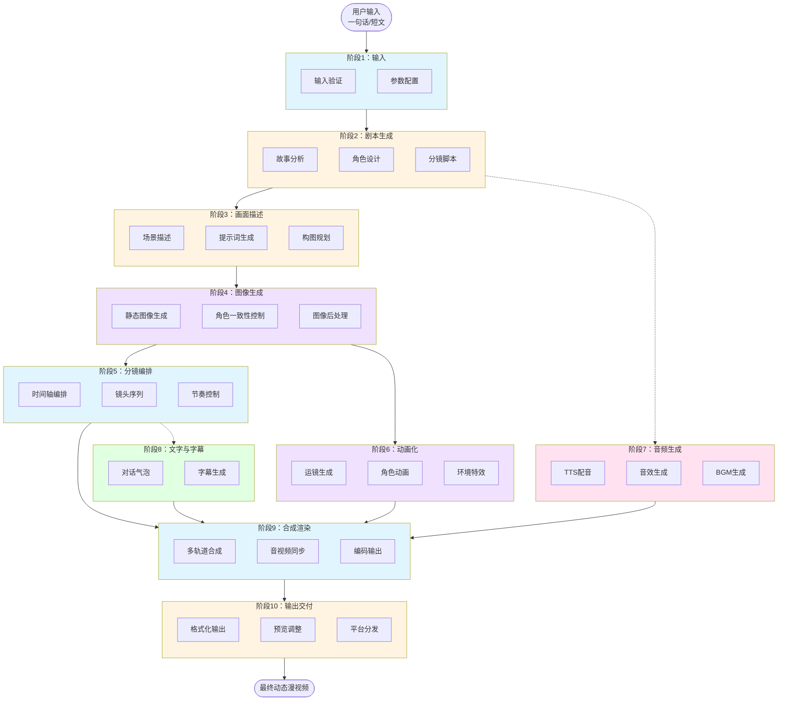

# FrameLeap 动态漫生成文档导航

## 文档结构

```
docs/
├── dynamic_comic_generation_process.md    # 主流程文档（概览）
├── README.md                               # 本文件（导航索引）
└── stages/                                 # 详细阶段文档
    ├── 01_input_stage.md                   # 阶段1：输入
    ├── 02_script_generation_stage.md       # 阶段2：剧本生成
    ├── 03_scene_description_stage.md       # 阶段3：画面描述
    ├── 04_image_generation_stage.md        # 阶段4：图像生成
    ├── 05_storyboard_stage.md              # 阶段5：分镜编排
    ├── 06_animation_stage.md               # 阶段6：动画化
    ├── 07_audio_generation_stage.md        # 阶段7：音频生成
    ├── 08_text_subtitle_stage.md           # 阶段8：文字与字幕
    ├── 09_composition_rendering_stage.md   # 阶段9：合成渲染
    └── 10_output_delivery_stage.md         # 阶段10：输出交付
```

---

## 快速导航

### 新手入门

1. 首先阅读 [主流程文档](dynamic_comic_generation_process.md) 了解整体架构
2. 然后根据需要深入阅读各阶段详细文档

### 按角色查阅

| 角色 | 推荐阅读 |
|-----|---------|
| 产品经理 | 主流程文档 + 阶段1、阶段10 |
| 后端开发 | 全部阶段文档 |
| AI工程师 | 阶段2、阶段3、阶段4、阶段6、阶段7 |
| 前端开发 | 主流程文档 + 阶段1、阶段10 |
| 测试人员 | 各阶段的"质量控制"部分 |

---

## 阶段文档摘要

### 阶段1：输入阶段
处理用户输入（一句话/短文），配置生成参数。

**关键内容**：
- 用户输入类型与验证
- 全局参数配置
- 输入预处理

### 阶段2：剧本生成阶段
使用LLM将用户输入扩展为完整剧本。

**关键内容**：
- 故事分析与规划
- 角色设定生成
- 分镜脚本生成
- 角色一致性确保

### 阶段3：画面描述生成阶段
将剧本转化为图像生成提示词。

**关键内容**：
- 场景描述生成
- 提示词工程
- 构图描述
- 留白处理

### 阶段4：图像生成阶段
使用文生图模型生成静态图像。

**关键内容**：
- 文生图生成
- 角色一致性控制（LoRA、ControlNet、IP-Adapter）
- 多视角生成
- 图像后处理

### 阶段5：分镜编排阶段
规划镜头序列和节奏。

**关键内容**：
- 时间轴编排
- 镜头类型分配
- 节奏控制
- 转场设计

### 阶段6：动画化阶段
将静态图像转换为动态视频。

**关键内容**：
- 运镜生成（平移、缩放、旋转）
- 角色动画
- 环境动画
- 特效动画
- 帧插值

### 阶段7：音频生成阶段
生成配音、音效和背景音乐。

**关键内容**：
- TTS语音合成
- 角色音色一致性
- 音效生成
- BGM生成/选择
- 音频混音

### 阶段8：文字与字幕阶段
添加对话气泡和字幕。

**关键内容**：
- 对话气泡生成
- 气泡样式设计
- 字幕生成
- 文字渲染

### 阶段9：合成渲染阶段
合成所有元素为最终视频。

**关键内容**：
- 多轨道合成
- 转场渲染
- 音视频同步
- 编码输出
- 质量控制

### 阶段10：输出交付阶段
格式化并交付最终成品。

**关键内容**：
- 文件输出
- 预览与调整
- 批量处理
- 平台适配
- 质量报告

---

## 数据流图



**流程说明**：
- 实线箭头：主流程（顺序依赖）
- 虚线箭头：并行流程（可同时进行）
- 阶段6、7、8 可并行处理，提升生成效率

---

## 技术栈速查

| 模块 | 技术选择 |
|-----|---------|
| 语言模型 | GPT-4 / Claude / 本地模型 |
| 图像生成 | Stable Diffusion XL / SD3 / Flux |
| 角色一致性 | LoRA / IP-Adapter / ControlNet |
| 超分辨率 | Real-ESRGAN / SwinIR |
| 动画化 | AnimateDiff / LivePortrait / 运镜算法 |
| 帧插值 | RIFE / DAIN / FILM |
| TTS | Azure TTS / GPT-SoVITS / VITS |
| 音效生成 | AudioLDM / 音效库 |
| 音乐生成 | Suno / Udio / MusicGen |
| 视频处理 | FFmpeg / OpenCV / MoviePy |
| 图像处理 | PIL / OpenCV / NumPy |

---

*文档版本：1.0*
*最后更新：2026-02-02*
