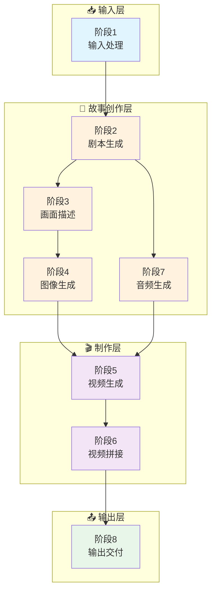
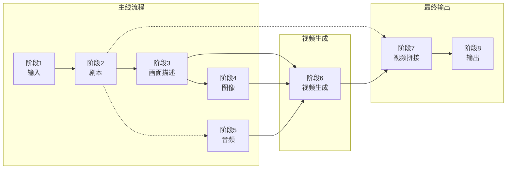

# FrameLeap 动态漫生成流程图

## 快速概览



---

## 核心变更说明

### 使用通义万相 wan2.6-i2v API

**API参数**:
- `prompt`: 提示词
- `img_url`: 图片URL
- `audio_url`: 音频URL

**简化效果**:
- ❌ 移除：分镜编排、动画化、文字字幕、合成渲染
- ✅ 保留：剧本生成、画面描述、图像生成、音频生成
- ✅ 新增：视频生成（图+音→视频）、视频拼接

---

## 阶段详情

### 📥 阶段1: 输入处理 (Input Processing)

| 项目 | 内容 |
|-----|------|
| **功能** | 接收并预处理用户输入 |
| **输入** | 文本/剧本/关键词 + 风格偏好 + 可选角色/图片 |
| **输出** | `InputData` (标准化输入数据) |
| **核心技术** | 文本清洗、验证评分、信息提取 |

---

### 📖 阶段2: 剧本生成 (Script Generation)

| 项目 | 内容 |
|-----|------|
| **功能** | 将用户输入转化为完整剧本 |
| **输入** | `InputData` (来自阶段1) |
| **输出** | `Script` (标题/场景/角色/对话/节奏曲线) |
| **核心技术** | 千问/GPT-4/Claude 等 LLM |
| **依赖** | 阶段1 |

**输出数据结构**:
```python
Script {
    title: str              # 剧本标题
    story_type: str         # 故事类型
    scenes: List[Scene]     # 场景列表
    characters: Dict        # 角色设定
    rhythm_curve: List      # 节奏曲线
}

Scene {
    order: int              # 序号
    title: str              # 场景标题
    description: str        # 场景描述
    atmosphere: str         # 氛围
    characters: List[str]   # 出场角色
    dialog: str             # 对话
    voiceover: str          # 旁白/独白（用于TTS）
}
```

---

### 🎨 阶段3: 画面描述生成 (Scene Description & Prompt Engineering)

| 项目 | 内容 |
|-----|------|
| **功能** | 将剧本转化为AI绘画提示词和视频提示词 |
| **输入** | `Script` (来自阶段2) + `StyleConfig` (来自阶段1) |
| **输出** | `ScenePrompts[]` (场景提示词列表) |
| **核心技术** | LLM + Prompt工程 |
| **依赖** | 阶段1, 阶段2 |

**输出数据结构**:
```python
ScenePrompt {
    scene_id: str           # 场景ID
    image_prompt: str       # 图像生成提示词
    video_prompt: str       # 视频生成提示词（扩展描述）
    composition: str        # 构图
    lighting: str           # 光影
    camera_angle: str       # 拍摄角度
    shot_size: str          # 景别
    style_tags: List[str]   # 风格标签
    quality_tags: List[str] # 质量标签
}
```

---

### 🖼️ 阶段4: 图像生成 (Image Generation)

| 项目 | 内容 |
|-----|------|
| **功能** | 根据提示词生成场景图像 |
| **输入** | `ScenePrompts[]` + `Character` + `StyleConfig` |
| **输出** | `SceneImages[]` (高分辨率图像URL) |
| **核心技术** | 通义万相/Flux/SD |
| **依赖** | 阶段1, 阶段2, 阶段3 |

**技术栈**:
- **主模型**: 通义万相 / Flux API / Stable Diffusion XL
- **输出格式**: 公网可访问的图片URL

**输出数据结构**:
```python
SceneImage {
    scene_id: str           # 场景ID
    image_url: str          # 图片URL（公网可访问）
    image_path: str         # 本地路径
    seed: int               # 生成种子
    metadata: Dict          # 元数据
}
```

---

### 🔊 阶段5: 音频生成 (Audio Generation)

| 项目 | 内容 |
|-----|------|
| **功能** | 生成配音（TTS）和背景音乐 |
| **输入** | `Script` (对话/旁白) + `VideoConfig` (时长) |
| **输出** | `AudioTracks` (音频文件URL) |
| **核心技术** | TTS + 音乐生成 |
| **依赖** | 阶段2 |

**技术栈**:
- **语音合成**: Azure TTS / Fish Audio / GPT-SoVITS
- **音乐生成**: Suno / Udio / 选择BGM库

**输出数据结构**:
```python
AudioTrack {
    scene_id: str           # 场景ID
    audio_url: str          # 音频URL（公网可访问）
    audio_path: str         # 本地路径
    duration: float         # 时长
    type: str               # 类型: dialogue/music/mixed
}
```

---

### 🎬 阶段6: 视频生成 (Video Generation)

| 项目 | 内容 |
|-----|------|
| **功能** | 使用通义万相wan2.6-i2v将图片+音频生成视频 |
| **输入** | `SceneImages[]` (图片URL) + `AudioTracks[]` (音频URL) + `ScenePrompts[]` |
| **输出** | `SceneVideos[]` (视频片段URL) |
| **核心技术** | 通义万相 wan2.6-i2v API |
| **依赖** | 阶段3, 阶段4, 阶段5 |

**API调用示例**:
```bash
curl --location 'https://dashscope.aliyuncs.com/api/v1/services/aigc/video-generation/video-synthesis' \
    -H 'X-DashScope-Async: enable' \
    -H "Authorization: Bearer $DASHSCOPE_API_KEY" \
    -H 'Content-Type: application/json' \
    -d '{
    "model": "wan2.6-i2v",
    "input": {
        "prompt": "视频描述提示词",
        "img_url": "图片URL",
        "audio_url": "音频URL"
    },
    "parameters": {
        "resolution": "720P",
        "prompt_extend": true,
        "duration": 10,
        "audio": true,
        "shot_type": "multi"
    }
}'
```

**输出数据结构**:
```python
SceneVideo {
    scene_id: str           # 场景ID
    video_url: str          # 视频URL
    video_path: str         # 本地路径
    duration: float         # 时长
    task_id: str            # 异步任务ID
    metadata: Dict          # 元数据
}
```

---

### 🎞️ 阶段7: 视频拼接 (Video Concat)

| 项目 | 内容 |
|-----|------|
| **功能** | 将多个场景视频拼接成完整视频 |
| **输入** | `SceneVideos[]` (视频片段列表) + `Script` (场景顺序) |
| **输出** | `FinalVideo` (完整视频文件) |
| **核心技术** | FFmpeg |
| **依赖** | 阶段2, 阶段6 |

**技术实现**:
```bash
# 使用FFmpeg拼接视频
ffmpeg -f concat -safe 0 -i file_list.txt -c copy output.mp4

# 或使用滤镜转场拼接
ffmpeg -i scene1.mp4 -i scene2.mp4 -filter_complex "[0:v][1:v]xfade=transition=fade:duration=1:offset=5" output.mp4
```

**输出数据结构**:
```python
FinalVideo {
    video_path: str         # 视频路径
    duration: float         # 总时长
    resolution: str         # 分辨率
    format: str             # 格式 (MP4)
    scene_count: int        # 场景数量
}
```

---

### 📤 阶段8: 输出交付 (Output & Delivery)

| 项目 | 内容 |
|-----|------|
| **功能** | 格式化并打包交付文件 |
| **输入** | `FinalVideo` |
| **输出** | `FinalOutput` (视频 + 元数据) |
| **核心技术** | 文件处理 |
| **依赖** | 阶段7 |

**交付内容**:
```
FinalOutput/
├── video.mp4          # 主视频
├── metadata.json      # 元数据（剧本、场景信息）
└── thumbnails/        # 缩略图
```

---

## 数据依赖关系



### 重新生成依赖规则

| 重新生成阶段 | 需要重新执行 | 说明 |
|-------------|-------------|------|
| 阶段2 (剧本) | 阶段3, 4, 5, 6, 7 | 剧本改变，后续全流程需重新执行 |
| 阶段3 (画面) | 阶段4, 6, 7 | 提示词改变，图像和视频需重新生成 |
| 阶段4 (图像) | 阶段6, 7 | 图像改变，视频需重新生成 |
| 阶段5 (音频) | 阶段6, 7 | 音频改变，视频需重新生成 |
| 阶段6 (视频) | 阶段7 | 视频片段改变，需重新拼接 |

---

## 技术栈总览

| 阶段 | 类别 | 云端API | 本地模型 |
|-----|------|---------|---------|
| 1 | 输入处理 | - | - |
| 2 | 剧本生成 | 千问 / Qwen / DeepSeek | Llama / Local |
| 3 | 画面描述 | 同上 | 同上 |
| 4 | 图像生成 | 通义万相 / Flux | SDXL / SD3 |
| 5 | 音频生成 | Azure / Fish / Suno | VITS / GPT-SoVITS |
| 6 | 视频生成 | **通义万相 wan2.6-i2v** | - |
| 7 | 视频拼接 | - | FFmpeg |
| 8 | 输出交付 | - | - |

---

## 通义万相 wan2.6-i2v 参数说明

### API参数

| 参数 | 类型 | 说明 |
|-----|------|------|
| `model` | str | 固定值: `wan2.6-i2v` |
| `input.prompt` | str | 视频生成提示词 |
| `input.img_url` | str | 输入图片URL（公网可访问） |
| `input.audio_url` | str | 输入音频URL（公网可访问） |
| `parameters.resolution` | str | 分辨率: `720P` / `480P` |
| `parameters.prompt_extend` | bool | 是否扩展提示词 |
| `parameters.duration` | int | 视频时长（秒） |
| `parameters.audio` | bool | 是否使用音频 |
| `parameters.shot_type` | str | 镜头类型: `single` / `multi` |

### 查询任务状态

```bash
curl --request GET 'https://dashscope.aliyuncs.com/api/v1/tasks/{task_id}' \
--header "Authorization: Bearer $DASHSCOPE_API_KEY"
```

### 响应示例

```json
{
  "output": {
    "video_url": "https://xxx.mp4"
  },
  "task_id": "xxx",
  "task_status": "SUCCEEDED"
}
```

---

## 实现状态

### 进度概览

```
███████████████████████████████░░░░  62.5% 完成
```

### 详细状态

| 阶段 | 状态 | 说明 |
|-----|------|------|
| 1. 输入处理 | ✅ 已实现 | Web界面输入、验证 |
| 2. 剧本生成 | ✅ 已实现 | 使用千问LLM |
| 3. 画面描述 | ✅ 已实现 | LLM + Prompt工程 |
| 4. 图像生成 | ✅ 已实现 | 使用通义万相 |
| 5. 音频生成 | 🚧 待实现 | TTS + BGM |
| 6. 视频生成 | 🚧 待实现 | wan2.6-i2v API |
| 7. 视频拼接 | 🚧 待实现 | FFmpeg拼接 |
| 8. 输出交付 | 🚧 待实现 | 文件打包 |

### 当前后端功能

- ✅ 4阶段流程展示（输入→剧本→画面→图像）
- ✅ WebSocket实时进度推送
- ✅ 逐阶段重新生成
- ✅ 瀑布流式布局

### 待开发功能

- 🚧 阶段5: 音频生成
- 🚧 阶段6: 视频生成（调用wan2.6-i2v）
- 🚧 阶段7: 视频拼接
- 🚧 阶段8: 输出交付
- 🚧 扩展Web界面支持8阶段流程

---

*文档版本: 3.0*
*最后更新: 2026-02-05*
*重大变更: 使用通义万相wan2.6-i2v简化视频生成流程*
