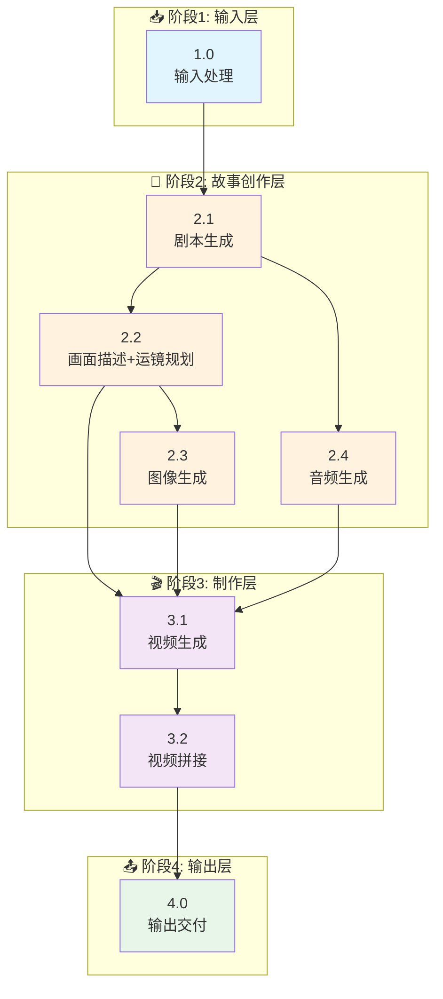
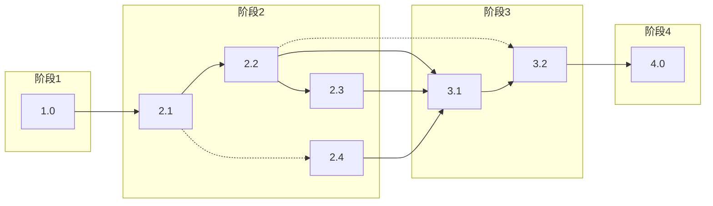

# FrameLeap 动态漫生成流程图

## 快速概览



---

## 阶段总览

| 阶段 | 子阶段 | 名称 | 状态 |
|-----|-------|------|------|
| **阶段1** | 1.0 | 输入处理 | ✅ 已实现 |
| **阶段2** | 2.1 | 剧本生成 | ✅ 已实现 |
| | 2.2 | 画面描述+运镜规划 | ✅ 已实现 |
| | 2.3 | 图像生成 | ✅ 已实现 |
| | 2.4 | 音频生成 | 🚧 待实现 |
| **阶段3** | 3.1 | 视频生成 | 🚧 待实现 |
| | 3.2 | 视频拼接 | 🚧 待实现 |
| **阶段4** | 4.0 | 输出交付 | 🚧 待实现 |

---

## 阶段1: 输入处理

### 1.0 输入处理 (Input Processing)

| 项目 | 内容 |
|-----|------|
| **功能** | 接收并预处理用户输入 |
| **输入** | 文本/剧本/关键词 + 风格偏好 + 可选角色/图片 |
| **输出** | `InputData` (标准化输入数据) |
| **核心技术** | 文本清洗、验证评分、信息提取 |
| **状态** | ✅ 已实现 |

---

## 阶段2: 故事创作层

### 2.1 剧本生成 (Script Generation)

| 项目 | 内容 |
|-----|------|
| **功能** | 将用户输入转化为完整剧本 |
| **输入** | `InputData` (来自阶段1) |
| **输出** | `Script` (标题/场景/角色/对话/节奏曲线) |
| **核心技术** | 千问/GPT-4/Claude 等 LLM |
| **状态** | ✅ 已实现 |

**输出数据结构**:
```python
Script {
    title: str              # 剧本标题
    story_type: str         # 故事类型
    scenes: List[Scene]     # 场景列表
    characters: Dict        # 角色设定
    rhythm_curve: List      # 节奏曲线
}

Scene {
    order: int              # 序号
    title: str              # 场景标题
    description: str        # 场景描述
    atmosphere: str         # 氛围
    characters: List[str]   # 出场角色
    dialog: str             # 对话
    voiceover: str          # 旁白/独白（用于TTS）
}
```

---

### 2.2 画面描述与运镜规划 (Scene Description & Camera Planning)

| 项目 | 内容 |
|-----|------|
| **功能** | 将剧本转化为AI绘画提示词、视频提示词和运镜方案 |
| **输入** | `Script` (来自2.1) + `StyleConfig` (来自1.0) |
| **输出** | `ScenePrompts[]` + `CameraShots[]` |
| **核心技术** | LLM + Prompt工程 + 运镜规划算法 |
| **状态** | ✅ 已实现 |

**输出数据结构**:
```python
ScenePrompt {
    scene_id: str           # 场景ID
    image_prompt: str       # 图像生成提示词
    video_prompt: str       # 视频生成提示词（扩展描述）
    composition: str        # 构图
    lighting: str           # 光影
    camera_angle: str       # 拍摄角度
    shot_size: str          # 景别
    style_tags: List[str]   # 风格标签
    quality_tags: List[str] # 质量标签
}

CameraShot {
    scene_id: str           # 场景ID
    shot_size: ShotSize     # 景别: extreme_long/long/full/medium/close/extreme_close
    camera_movement: CameraMovement  # 运镜: static/pan/tilt/zoom/dolly/track/arc
    movement_speed: float   # 运镜速度 0.1-10
    angle: float            # 拍摄角度（度） 负数俯视 正数仰视
    focus_point: Vector2    # 焦点位置（归一化0-1）
    transition_in: TransitionType   # 入场转场
    transition_out: TransitionType  # 出场转场
}
```

**运镜规划规则**:

| 场景位置 | 景别 | 运镜 | 说明 |
|---------|------|------|------|
| 开场 (0%) | LONG (远景) | static/pan_right | 建立环境，缓慢展示 |
| 发展 (25-50%) | MEDIUM (中景) | dolly_in/track_left | 跟随角色，推进情节 |
| 高潮 (75%) | CLOSE (近景) | zoom_in/arc | 情感集中，增强张力 |
| 结尾 (100%) | MEDIUM (中景) | dolly_out | 平缓收尾 |

**子任务**:
| 子任务 | 说明 | 状态 |
|-------|------|------|
| 2.2.1 | 生成图像/视频提示词 | ✅ 已实现 |
| 2.2.2 | 规划景别 (shot_size) | ✅ 已实现 |
| 2.2.3 | 规划运镜 (camera_movement) | 🚧 待实现 |
| 2.2.4 | 规划转场 (transition) | 🚧 待实现 |

---

### 2.3 图像生成 (Image Generation)

| 项目 | 内容 |
|-----|------|
| **功能** | 根据提示词生成场景图像 |
| **输入** | `ScenePrompts[]` (来自2.2) + `Character` + `StyleConfig` |
| **输出** | `SceneImages[]` (高分辨率图像URL) |
| **核心技术** | 通义万相/Flux/SD |
| **状态** | ✅ 已实现 |

**技术栈**:
- **主模型**: 通义万相 / Flux API / Stable Diffusion XL
- **输出格式**: 公网可访问的图片URL

**输出数据结构**:
```python
SceneImage {
    scene_id: str           # 场景ID
    image_url: str          # 图片URL（公网可访问）
    image_path: str         # 本地路径
    seed: int               # 生成种子
    metadata: Dict          # 元数据
}
```

---

### 2.4 音频生成 (Audio Generation)

| 项目 | 内容 |
|-----|------|
| **功能** | 生成配音（TTS）和背景音乐 |
| **输入** | `Script` (对话/旁白，来自2.1) + `VideoConfig` (时长) |
| **输出** | `AudioTracks[]` (音频文件URL) |
| **核心技术** | TTS + 音乐生成 |
| **状态** | 🚧 待实现 |

**技术栈**:
- **语音合成**: Azure TTS / Fish Audio / GPT-SoVITS
- **音乐生成**: Suno / Udio / 选择BGM库

**输出数据结构**:
```python
AudioTrack {
    scene_id: str           # 场景ID
    audio_url: str          # 音频URL（公网可访问）
    audio_path: str         # 本地路径
    duration: float         # 时长
    type: str               # 类型: dialogue/music/mixed
}
```

**子任务**:
| 子任务 | 说明 | 状态 |
|-------|------|------|
| 2.4.1 | TTS语音生成 | 🚧 待实现 |
| 2.4.2 | BGM音乐选择/生成 | 🚧 待实现 |
| 2.4.3 | 音频混音 | 🚧 待实现 |
| 2.4.4 | 上传至公网URL | 🚧 待实现 |

---

## 阶段3: 制作层

### 3.1 视频生成 (Video Generation)

| 项目 | 内容 |
|-----|------|
| **功能** | 使用通义万相wan2.6-i2v将图片+音频生成视频 |
| **输入** | `SceneImages[]` (来自2.3) + `AudioTracks[]` (来自2.4) + `CameraShots[]` (来自2.2) |
| **输出** | `SceneVideos[]` (视频片段URL) |
| **核心技术** | 通义万相 wan2.6-i2v API |
| **状态** | 🚧 待实现 |

**API调用示例**:
```bash
curl --location 'https://dashscope.aliyuncs.com/api/v1/services/aigc/video-generation/video-synthesis' \
    -H 'X-DashScope-Async: enable' \
    -H "Authorization: Bearer $DASHSCOPE_API_KEY" \
    -H 'Content-Type: application/json' \
    -d '{
    "model": "wan2.6-i2v",
    "input": {
        "prompt": "视频描述提示词",
        "img_url": "图片URL",
        "audio_url": "音频URL"
    },
    "parameters": {
        "resolution": "720P",
        "prompt_extend": true,
        "duration": 10,
        "audio": true,
        "shot_type": "multi"
    }
}'
```

**运镜参数映射**:
| CameraShot | API参数 | 说明 |
|-----------|---------|------|
| shot_size | prompt中描述 | 在提示词中描述景别 |
| camera_movement | shot_type | `static`→single, 其他→multi |
| angle | prompt中描述 | "high angle view" / "low angle view" |

**输出数据结构**:
```python
SceneVideo {
    scene_id: str           # 场景ID
    video_url: str          # 视频URL
    video_path: str         # 本地路径
    duration: float         # 时长
    task_id: str            # 异步任务ID
    metadata: Dict          # 元数据
}
```

**子任务**:
| 子任务 | 说明 | 状态 |
|-------|------|------|
| 3.1.1 | 根据运镜方案构建API参数 | 🚧 待实现 |
| 3.1.2 | 调用wan2.6-i2v API | 🚧 待实现 |
| 3.1.3 | 轮询任务状态 | 🚧 待实现 |
| 3.1.4 | 下载视频到本地 | 🚧 待实现 |

---

### 3.2 视频拼接 (Video Concat)

| 项目 | 内容 |
|-----|------|
| **功能** | 将多个场景视频拼接成完整视频 |
| **输入** | `SceneVideos[]` (来自3.1) + `CameraShots[]` (转场信息，来自2.2) |
| **输出** | `FinalVideo` (完整视频文件) |
| **核心技术** | FFmpeg |
| **状态** | 🚧 待实现 |

**技术实现**:
```bash
# 简单拼接（无转场）
ffmpeg -f concat -safe 0 -i file_list.txt -c copy output.mp4

# 带转场拼接
ffmpeg -i scene1.mp4 -i scene2.mp4 \
    -filter_complex "[0:v][1:v]xfade=transition=fade:duration=1:offset=5" \
    output.mp4
```

**转场效果映射**:
| TransitionType | FFmpeg xfade transition |
|---------------|----------------------|
| CUT | cut |
| FADE_IN / FADE_OUT / CROSS_FADE | fade |
| WIPE_LEFT / WIPE_RIGHT | wipeleft / wiperight |
| WIPE_UP / WIPE_DOWN | wipeup / wipedown |
| ZOOM_IN / ZOOM_OUT | zoomin / zoomout |

**输出数据结构**:
```python
FinalVideo {
    video_path: str         # 视频路径
    duration: float         # 总时长
    resolution: str         # 分辨率
    format: str             # 格式 (MP4)
    scene_count: int        # 场景数量
}
```

**子任务**:
| 子任务 | 说明 | 状态 |
|-------|------|------|
| 3.2.1 | 根据转场方案生成拼接命令 | 🚧 待实现 |
| 3.2.2 | FFmpeg拼接处理 | 🚧 待实现 |
| 3.2.3 | 可选: 添加转场效果 | 🚧 待实现 |

---

## 阶段4: 输出层

### 4.0 输出交付 (Output & Delivery)

| 项目 | 内容 |
|-----|------|
| **功能** | 格式化并打包交付文件 |
| **输入** | `FinalVideo` (来自3.2) |
| **输出** | `FinalOutput` (视频 + 元数据) |
| **核心技术** | 文件处理 |
| **状态** | 🚧 待实现 |

**交付内容**:
```
FinalOutput/
├── video.mp4          # 主视频
├── metadata.json      # 元数据（剧本、场景信息）
└── thumbnails/        # 缩略图
```

**子任务**:
| 子任务 | 说明 | 状态 |
|-------|------|------|
| 4.0.1 | 生成视频缩略图 | 🚧 待实现 |
| 4.0.2 | 保存元数据JSON | 🚧 待实现 |
| 4.0.3 | 打包输出目录 | 🚧 待实现 |

---

## 数据依赖关系



### 运镜数据流向

```
2.2 画面描述+运镜规划
        │
        ├─── CameraShot.shot_size ─────┐
        ├─── CameraShot.camera_movement ┤
        ├─── CameraShot.angle ──────────┤
        └─── CameraShot.transition ──────┤
                                        │
                                        ▼
                              3.1 视频生成 (构建API参数)
                                        │
                                        ▼
                              3.2 视频拼接 (应用转场)
```

### 重新生成依赖规则

| 重新生成阶段 | 需要重新执行 | 说明 |
|-------------|-------------|------|
| 2.1 剧本 | 2.2, 2.3, 2.4, 3.1, 3.2 | 剧本改变，后续全流程需重新执行 |
| 2.2 画面+运镜 | 2.3, 3.1, 3.2 | 提示词/运镜改变，图像和视频需重新生成 |
| 2.3 图像 | 3.1, 3.2 | 图像改变，视频需重新生成 |
| 2.4 音频 | 3.1, 3.2 | 音频改变，视频需重新生成 |
| 3.1 视频 | 3.2 | 视频片段改变，需重新拼接 |

---

## 技术栈总览

| 阶段 | 子阶段 | 类别 | 云端API | 本地模型 |
|-----|-------|------|---------|---------|
| 1 | 1.0 | 输入处理 | - | - |
| 2 | 2.1 | 剧本生成 | 千问 / Qwen / DeepSeek | Llama / Local |
| | 2.2 | 画面+运镜 | 同上 | 同上 |
| | 2.3 | 图像生成 | 通义万相 / Flux | SDXL / SD3 |
| | 2.4 | 音频生成 | Azure / Fish / Suno | VITS / GPT-SoVITS |
| 3 | 3.1 | 视频生成 | **通义万相 wan2.6-i2v** | - |
| | 3.2 | 视频拼接 | - | FFmpeg |
| 4 | 4.0 | 输出交付 | - | - |

---

## 运镜规划算法

### 景别选择逻辑

```python
def select_shot_size(position: float, total_scenes: int) -> ShotSize:
    """根据场景位置选择景别

    Args:
        position: 场景位置比例 (0.0 - 1.0)
        total_scenes: 总场景数

    Returns:
        ShotSize: 景别枚举
    """
    if position < 0.1:
        return ShotSize.EXTREME_LONG  # 大远景开场
    elif position < 0.25:
        return ShotSize.LONG  # 远景建立环境
    elif position > 0.9:
        return ShotSize.MEDIUM  # 中景收尾
    elif position > 0.75:
        return ShotSize.CLOSE  # 近景高潮
    else:
        return ShotSize.MEDIUM  # 中景推进
```

### 运镜选择逻辑

```python
def select_camera_movement(
    shot_size: ShotSize,
    atmosphere: str,
    position: float
) -> CameraMovement:
    """根据景别和氛围选择运镜

    Args:
        shot_size: 景别
        atmosphere: 氛围 (tense/relaxed/mystery/etc)
        position: 场景位置

    Returns:
        CameraMovement: 运镜类型
    """
    # 远景通常用平移或固定
    if shot_size in [ShotSize.EXTREME_LONG, ShotSize.LONG]:
        return CameraMovement.PAN_RIGHT if position < 0.5 else CameraMovement.STATIC

    # 近景/特写用推拉或环绕
    if shot_size in [ShotSize.CLOSE, ShotSize.EXTREME_CLOSE]:
        if atmosphere == "tense":
            return CameraMovement.ZOOM_IN
        else:
            return CameraMovement.ARC_LEFT

    # 中景根据氛围决定
    if atmosphere == "tense":
        return CameraMovement.DOLLY_IN
    elif atmosphere == "relaxed":
        return CameraMovement.TRACK_LEFT
    else:
        return CameraMovement.STATIC
```

### 转场选择逻辑

```python
def select_transition(
    current_scene: int,
    total_scenes: int,
    atmosphere_change: str
) -> TransitionType:
    """选择转场类型

    Args:
        current_scene: 当前场景序号
        total_scenes: 总场景数
        atmosphere_change: 氛围变化 (sharp/gradual/none)

    Returns:
        TransitionType: 转场类型
    """
    # 开场淡入
    if current_scene == 0:
        return TransitionType.FADE_IN

    # 结尾淡出
    if current_scene == total_scenes - 1:
        return TransitionType.FADE_OUT

    # 氛围剧变用擦除
    if atmosphere_change == "sharp":
        return TransitionType.WIPE_LEFT

    # 平滑过渡用溶解
    if atmosphere_change == "gradual":
        return TransitionType.CROSS_FADE

    # 默认切换
    return TransitionType.CUT
```

---

## 通义万相 wan2.6-i2v 参数说明

### API参数

| 参数 | 类型 | 说明 |
|-----|------|------|
| `model` | str | 固定值: `wan2.6-i2v` |
| `input.prompt` | str | 视频生成提示词 |
| `input.img_url` | str | 输入图片URL（公网可访问） |
| `input.audio_url` | str | 输入音频URL（公网可访问） |
| `parameters.resolution` | str | 分辨率: `720P` / `480P` |
| `parameters.prompt_extend` | bool | 是否扩展提示词 |
| `parameters.duration` | int | 视频时长（秒） |
| `parameters.audio` | bool | 是否使用音频 |
| `parameters.shot_type` | str | 镜头类型: `single` / `multi` |

### shot_type 参数映射

| CameraShot.shot_type | API参数 | 说明 |
|---------------------|---------|------|
| 静态镜头 (static) | `single` | 单镜头模式 |
| 运动镜头 (其他) | `multi` | 多镜头模式，自动添加运镜效果 |

### 查询任务状态

```bash
curl --request GET 'https://dashscope.aliyuncs.com/api/v1/tasks/{task_id}' \
--header "Authorization: Bearer $DASHSCOPE_API_KEY"
```

### 响应示例

```json
{
  "output": {
    "video_url": "https://xxx.mp4"
  },
  "task_id": "xxx",
  "task_status": "SUCCEEDED"
}
```

---

## 实现状态

### 进度概览

```
阶段1: ████████████████████████  100%
阶段2: ████████████████░░░░░░░░░  75%  (3/4完成, 2.2运镜规划部分待实现)
阶段3: ░░░░░░░░░░░░░░░░░░░░░░░░░   0%  (0/2完成)
阶段4: ░░░░░░░░░░░░░░░░░░░░░░░░░   0%  (0/1完成)

总体: ████████████████░░░░░░░░░  62.5%
```

### 详细状态

| 阶段 | 子阶段 | 名称 | 状态 | 说明 |
|-----|-------|------|------|------|
| 阶段1 | 1.0 | 输入处理 | ✅ 已实现 | Web界面输入、验证 |
| 阶段2 | 2.1 | 剧本生成 | ✅ 已实现 | 使用千问LLM |
| | 2.2 | 画面+运镜 | 🚧 部分实现 | 提示词✅ 运镜规划🚧 |
| | 2.3 | 图像生成 | ✅ 已实现 | 使用通义万相 |
| | 2.4 | 音频生成 | 🚧 待实现 | TTS + BGM |
| 阶段3 | 3.1 | 视频生成 | 🚧 待实现 | wan2.6-i2v API |
| | 3.2 | 视频拼接 | 🚧 待实现 | FFmpeg拼接 |
| 阶段4 | 4.0 | 输出交付 | 🚧 待实现 | 文件打包 |

### 当前后端功能

- ✅ 阶段1-2.3完整流程（输入→剧本→画面→图像）
- ✅ WebSocket实时进度推送
- ✅ 逐阶段重新生成
- ✅ 瀑布流式布局

### 待开发功能

- 🚧 2.2: 运镜规划算法（景别/运镜/转场）
- 🚧 2.4: 音频生成（TTS + BGM + 上传）
- 🚧 3.1: 视频生成（wan2.6-i2v API调用 + 运镜参数映射）
- 🚧 3.2: 视频拼接（FFmpeg + 转场效果）
- 🚧 4.0: 输出交付
- 🚧 扩展Web界面支持完整流程

---

*文档版本: 5.0*
*最后更新: 2026-02-05*
*重大变更: 运镜规划在2.2阶段生成，用于3.1/3.2阶段*
