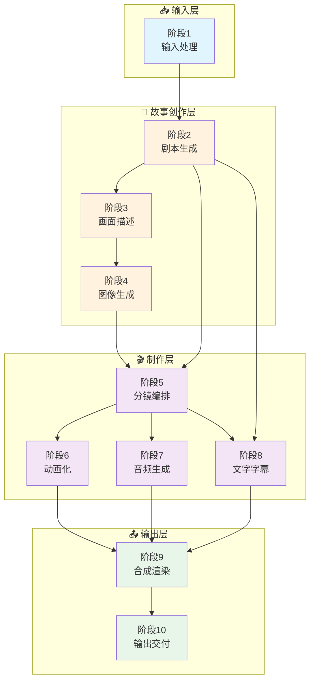
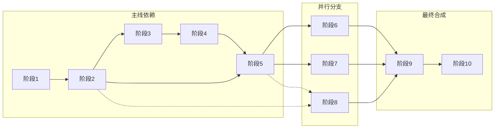

# FrameLeap 动态漫生成流程图

## 快速概览



---

## 阶段详情

### 📥 阶段1: 输入处理 (Input Processing)

| 项目 | 内容 |
|-----|------|
| **功能** | 接收并预处理用户输入 |
| **输入** | 文本/剧本/关键词 + 风格偏好 + 视频参数 + 可选角色/图片 |
| **输出** | `InputData` (标准化输入数据) |
| **核心技术** | 文本清洗、验证评分、信息提取 |

---

### 📖 阶段2: 剧本生成 (Script Generation)

| 项目 | 内容 |
|-----|------|
| **功能** | 将用户输入转化为完整剧本 |
| **输入** | `InputData` (来自阶段1) |
| **输出** | `Script` (标题/场景/角色/对话/节奏曲线) |
| **核心技术** | 千问/GPT-4/Claude 等 LLM |
| **依赖** | 阶段1 |

**输出数据结构**:
```python
Script {
    title: str              # 剧本标题
    story_type: str         # 故事类型
    scenes: List[Scene]     # 场景列表
    characters: Dict        # 角色设定
    rhythm_curve: List      # 节奏曲线
}

Scene {
    order: int              # 序号
    title: str              # 场景标题
    description: str        # 场景描述
    atmosphere: str         # 氛围
    characters: List[str]   # 出场角色
    dialog: str             # 对话
}
```

---

### 🎨 阶段3: 画面描述生成 (Scene Description & Prompt Engineering)

| 项目 | 内容 |
|-----|------|
| **功能** | 将剧本转化为AI绘画提示词 |
| **输入** | `Script` (来自阶段2) + `StyleConfig` (来自阶段1) |
| **输出** | `ScenePrompts[]` (场景提示词列表) |
| **核心技术** | LLM + Prompt工程 |
| **依赖** | 阶段1, 阶段2 |

**输出数据结构**:
```python
ScenePrompt {
    scene_id: str           # 场景ID
    prompt: str             # 正向提示词
    negative_prompt: str    # 负向提示词
    composition: str        # 构图
    lighting: str           # 光影
    camera_angle: str       # 拍摄角度
    shot_size: str          # 景别
    style_tags: List[str]   # 风格标签
    quality_tags: List[str] # 质量标签
}
```

---

### 🖼️ 阶段4: 图像生成 (Image Generation)

| 项目 | 内容 |
|-----|------|
| **功能** | 根据提示词生成场景图像 |
| **输入** | `ScenePrompts[]` + `Character` + `StyleConfig` |
| **输出** | `SceneImages[]` (高分辨率图像文件) |
| **核心技术** | 通义万相/Flux/SD + 控制网络 + 超分辨率 |
| **依赖** | 阶段1, 阶段2, 阶段3 |

**技术栈**:
- **主模型**: Stable Diffusion XL / SD3 / Flux API
- **角色一致性**: IP-Adapter / LoRA / Reference
- **后处理**: Real-ESRGAN / SwinIR

---

### 🎬 阶段5: 分镜编排 (Storyboard & Shot Planning)

| 项目 | 内容 |
|-----|------|
| **功能** | 规划镜头序列和时间轴 |
| **输入** | `Script` + `SceneImages[]` + `VideoConfig` |
| **输出** | `Timeline` (镜头序列 + 时间轴) |
| **核心技术** | 时长计算/镜头分配/转场设计 |
| **依赖** | 阶段1, 阶段2, 阶段4 |

**输出数据结构**:
```python
Timeline {
    shots: List[Shot]       # 镜头列表
    audio_sync: Dict        # 音频同步点
    total_duration: float   # 总时长
}

Shot {
    shot_id: str            # 镜头ID
    scene_id: str           # 关联场景
    start_time: float       # 开始时间
    duration: float         # 持续时间
    shot_size: str          # 景别
    camera_movement: str    # 运镜
    transition: str         # 转场
}
```

---

### 🎞️ 阶段6: 动画化 (Animation)

| 项目 | 内容 |
|-----|------|
| **功能** | 将静态图像转化为动画 |
| **输入** | `Timeline` + `SceneImages[]` |
| **输出** | `AnimatedFrames[]` (帧序列/视频片段) |
| **核心技术** | AnimateDiff/LivePortrait + FFmpeg + 帧插值 |
| **依赖** | 阶段4, 阶段5 |

**技术栈**:
- **图像动画**: AnimateDiff / LivePortrait
- **帧插值**: RIFE / DAIN / FILM
- **视频处理**: FFmpeg

---

### 🔊 阶段7: 音频生成 (Audio Generation)

| 项目 | 内容 |
|-----|------|
| **功能** | 生成配音/音效/背景音乐 |
| **输入** | `Script` (对话) + `Timeline` (时长) |
| **输出** | `AudioTracks` (多轨音频) |
| **核心技术** | TTS + 音效生成 + 混音 |
| **依赖** | 阶段2, 阶段5 |

**技术栈**:
- **语音合成**: Azure TTS / Fish Audio / GPT-SoVITS
- **音效生成**: AudioLDM
- **音乐生成**: Suno / Udio
- **混音**: FFmpeg

---

### 💬 阶段8: 文字与字幕 (Text & Subtitle)

| 项目 | 内容 |
|-----|------|
| **功能** | 生成对话气泡和字幕 |
| **输入** | `Script` (对话) + `Timeline` (时间轴) |
| **输出** | `TextElements` (文字图层 + 字幕文件) |
| **核心技术** | 文字渲染 / 自动排版 / 时间轴对齐 |
| **依赖** | 阶段2, 阶段5 |

---

### 🎞️ 阶段9: 合成渲染 (Composition & Rendering)

| 项目 | 内容 |
|-----|------|
| **功能** | 合成视频/音频/文字轨道 |
| **输入** | `AnimatedFrames[]` + `AudioTracks` + `TextElements` |
| **输出** | `RenderedVideo` (最终视频文件) |
| **核心技术** | FFmpeg / MoviePy / OpenCV |
| **依赖** | 阶段5, 阶段6, 阶段7, 阶段8 |

**输出格式**:
- 主要格式: MP4 (H.264 + AAC)
- 可选格式: WEBM (VP9 + Opus), MOV

---

### 📤 阶段10: 输出交付 (Output & Delivery)

| 项目 | 内容 |
|-----|------|
| **功能** | 格式化并打包交付文件 |
| **输入** | `RenderedVideo` |
| **输出** | `FinalOutput` (视频 + 元数据 + 缩略图 + 报告) |
| **核心技术** | 文件处理 / 批量导出 |
| **依赖** | 阶段9 |

**交付内容**:
```
FinalOutput/
├── video.mp4          # 主视频
├── metadata.json      # 元数据
├── thumbnails/        # 缩略图
└── report.md          # 质量报告
```

---

## 数据依赖关系



### 重新生成依赖规则

| 重新生成阶段 | 需要重新执行 | 说明 |
|-------------|-------------|------|
| 阶段2 (剧本) | 阶段3, 4 | 剧本改变，画面描述和图像需重新生成 |
| 阶段3 (画面) | 阶段4 | 提示词改变，图像需重新生成 |
| 阶段4 (图像) | - | 可独立重新生成，直接替换 |
| 阶段5 (分镜) | 阶段6, 7, 8, 9 | 时间轴改变，后续阶段需重新执行 |
| 阶段6 (动画) | 阶段9 | 动画改变，需重新合成 |
| 阶段7 (音频) | 阶段9 | 音频改变，需重新合成 |
| 阶段8 (字幕) | 阶段9 | 字幕改变，需重新合成 |

---

## 技术栈总览

| 阶段 | 类别 | 云端API | 本地模型 |
|-----|------|---------|---------|
| 1 | 输入处理 | - | - |
| 2 | 剧本生成 | 千问 / Qwen / DeepSeek | Llama / Local |
| 3 | 画面描述 | 同上 | 同上 |
| 4 | 图像生成 | 通义万相 / Flux / SD | SDXL / SD3 |
| 5 | 分镜编排 | - | - |
| 6 | 动画化 | - | FFmpeg / AnimateDiff |
| 7 | 音频生成 | Azure / Fish / Suno | VITS / GPT-SoVITS |
| 8 | 字幕 | - | Pillow / Cairo |
| 9 | 合成渲染 | - | FFmpeg / MoviePy |
| 10 | 输出交付 | - | - |

---

## 实现状态

### 进度概览

```
████████████████████████████░░░░░░░░░░░░░  40% 完成
```

### 详细状态

| 阶段 | 状态 | 说明 |
|-----|------|------|
| 1. 输入处理 | ✅ 已实现 | Web界面输入、验证 |
| 2. 剧本生成 | ✅ 已实现 | 使用千问LLM |
| 3. 画面描述 | ✅ 已实现 | LLM + Prompt工程 |
| 4. 图像生成 | ✅ 已实现 | 使用通义万相 |
| 5. 分镜编排 | 🚧 待实现 | 时间轴规划 |
| 6. 动画化 | 🚧 待实现 | 运镜生成 |
| 7. 音频生成 | 🚧 待实现 | TTS + 音效 |
| 8. 字幕 | 🚧 待实现 | 对话气泡 |
| 9. 合成渲染 | 🚧 待实现 | 多轨道合成 |
| 10. 输出交付 | 🚧 待实现 | 文件打包 |

### 当前后端功能

- ✅ 4阶段流程展示
- ✅ WebSocket实时进度推送
- ✅ 逐阶段重新生成
- ✅ 瀑布流式布局

---

*文档版本: 2.0*
*最后更新: 2026-02-05*
